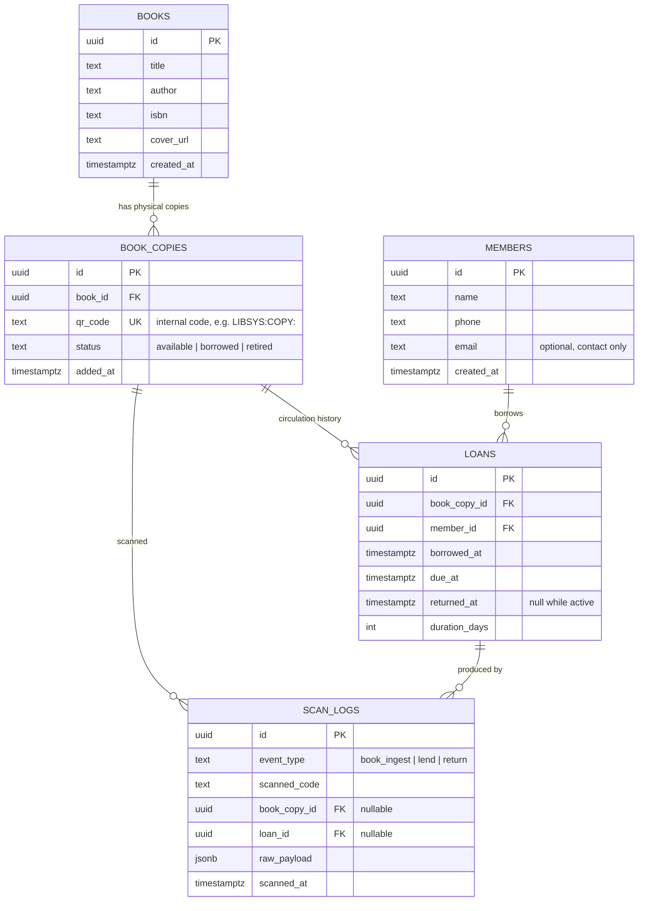

# Library Management System — System Design

A learning-first mini-project: build a real end-to-end system while practicing the general system-design thought process (requirements → data model → API → flows → trade-offs) before layering AI-specific system design on top of it later.

Stack locked in: **React (frontend) + Node/Express (backend) + Postgres on Supabase**, deployed on **Render**.

---

## 1. Actors & Scope

| Actor | Access | Can do |
|---|---|---|
| Admin | 1 person, email fixed via env config (`ADMIN_EMAIL`) | Everything: add books, lend, receive returns, view dashboard |
| Member (borrower) | No login, no app access | Exists only as a record the admin looks up. Never touches the system directly. |

This is deliberately a **single-actor system with one privileged operator** — there's no multi-tenant or public-facing surface. That simplifies auth a lot (one login, no roles/permissions matrix), which is intentional: we want the *first* pass at system design to be about data modeling, state, and flow correctness, not access control.

---

## 2. Functional Requirements

1. Admin can add a new book to inventory two ways:
   - **Scan path**: scan the book's printed ISBN barcode → system looks up title/author/cover via a free external API → admin confirms/edits → save.
   - **Manual path**: fill a modal form directly (for books with no barcode, or if lookup fails).
2. Every add-book scan is written to an **audit log** ("keep a log of the entry").
3. On save, the system mints its own **internal QR code**, one per physical copy (a title can have multiple copies).
4. Admin can lend a book: scan the copy's internal QR → system resolves the book/copy → admin searches for (or adds) the member → picks a loan duration → confirms → loan starts.
5. Admin can process a return: scan the *same* copy QR → system finds the open loan on that copy → admin confirms return.
6. Dashboard shows books due in ≤2 days ("due soon") and overdue books, computed on read (no push notifications in MVP — see §9).
7. Full history of scans and loans is retrievable (who borrowed what, when, returned when).

## 3. Non-Functional Requirements (small-scale, but designed properly)

- **Consistency**: two admins-in-two-tabs scanning the same copy at the same instant must not both succeed in creating a loan. Handled with a DB constraint, not just app-level checks (§8.3).
- **Auditability**: the log of scans is append-only and never mutated, independent of the "current state" tables. This is the one place we deliberately over-engineer relative to strict MVP needs, because it's a broadly reusable pattern (event log vs. current-state table).
- **Security**: single admin, but still: hashed password, JWT session, no secrets in the frontend bundle, parameterized SQL everywhere.
- **Simplicity over scale**: no caching layer, no queue, no microservices — this system will run at dozens of req/day. Calling that out explicitly matters as much as knowing when *to* add complexity.

---

## 4. High-Level Architecture

```
┌─────────────────┐        HTTPS/JSON        ┌──────────────────────┐        SQL         ┌─────────────────┐
│   React (Vite)   │ ───────────────────────▶ │   Express API (TS)    │ ─────────────────▶ │  Postgres        │
│   client app     │ ◀─────────────────────── │   (stateless, JWT)     │ ◀───────────────── │  (Supabase)      │
└─────────────────┘                          └──────────────────────┘                     └─────────────────┘
        │                                              │
        │ camera access (getUserMedia)                 │ calls out to
        ▼                                              ▼
   QR/barcode scan                            Open Library API (ISBN → metadata)
   (html5-qrcode, in-browser,                 (no key required, read-only lookup)
    decodes to a string, no
    server round-trip needed
    just to read the code)
```

Classic 3-tier: **client → API → database**. The Express server is the *only* thing that talks to Postgres — the frontend never sees a DB connection string or talks to Supabase directly. This is a deliberate choice over "Supabase as BaaS" (client SDK + Row Level Security): it's more moving parts to hand-roll auth/authorization in Postgres RLS than to just write it once in an Express middleware, and doing it this way teaches the classic pattern first (RLS-based design is a good *second* project).

---

## 5. Data Model



### Key modeling decision: `books` vs. `book_copies`

A **title** (e.g. "Clean Code") is not the same entity as a **physical item on a shelf**. Two copies of the same title need independent borrow status. This is exactly how real library systems (and Open Library / WorldCat) model it: a *bibliographic record* vs. an *item record*. It costs one extra join; it saves you from a data model that breaks the moment two copies of the same book exist.

### Key modeling decision: `scan_logs` is append-only, separate from state

`book_copies.status` and `loans.returned_at` are **current state** — they get overwritten. `scan_logs` is **history** — every scan ever made, even ones that failed to resolve to anything (e.g., an unrecognized code), for debugging and audit. Never `UPDATE` or `DELETE` a row here. This is a lightweight version of the event-sourcing idea: reconstructing "what happened" should never depend on mutable tables.

### Indexes worth calling out explicitly (not just "add indexes later")

- `book_copies.qr_code` — UNIQUE, and it's the lookup key for every scan (`WHERE qr_code = $1`). Without an index this is a full table scan on every single scan.
- `loans (book_copy_id) WHERE returned_at IS NULL` — a **partial unique index**. This is the mechanism that prevents the double-borrow race condition (see §8.3) — it's not just a performance index, it's a correctness constraint.
- `loans.due_at` — supports the due-soon/overdue dashboard queries.
- `members.name`, `members.phone` — trigram or plain B-tree depending on whether search is prefix or fuzzy (start with plain `ILIKE '%...%'` + B-tree; only add `pg_trgm` if search feels slow — don't pre-optimize).

---

## 6. API Design

Auth (JWT in an httpOnly cookie, not localStorage — avoids XSS token theft):

| Method | Path | Purpose |
|---|---|---|
| POST | `/api/auth/login` | email+password → sets httpOnly session cookie |
| POST | `/api/auth/logout` | clears cookie |
| GET | `/api/auth/me` | current session check |

Books & ingestion:

| Method | Path | Purpose |
|---|---|---|
| GET | `/api/books` | list titles with copy counts / availability |
| GET | `/api/books/:id` | title detail + its copies |
| GET | `/api/lookup/isbn/:isbn` | proxy to Open Library, returns title/author/cover for the add-book form to prefill |
| POST | `/api/books` | create title (+ first copy) — manual or scan-assisted; writes a `book_ingest` scan_log if a scan drove it |
| POST | `/api/books/:id/copies` | add another physical copy of an existing title → mints new QR |
| GET | `/api/copies/:copyId/qr.png` | renders the QR image on demand (see §8.4 — not stored as a blob) |

Circulation (the "one QR, two meanings" endpoint — see §8.2):

| Method | Path | Purpose |
|---|---|---|
| GET | `/api/scan/resolve?code=` | given a scanned copy QR, returns `{ copy, book, status, activeLoan? }` so the UI knows whether to render the **lend** form or the **return** confirmation |
| POST | `/api/loans` | `{ copyId, memberId, durationDays }` → creates loan, flips copy to `borrowed`, computes `due_at` |
| POST | `/api/loans/:id/return` | marks `returned_at = now()`, flips copy back to `available` |
| GET | `/api/loans?status=active\|overdue\|due_soon` | listings for dashboard/history |

Members:

| Method | Path | Purpose |
|---|---|---|
| GET | `/api/members?q=` | search by name/phone for the lend flow |
| POST | `/api/members` | inline "add new member" during lending |

Dashboard:

| Method | Path | Purpose |
|---|---|---|
| GET | `/api/dashboard/summary` | counts: total books, active loans, due soon, overdue |
| GET | `/api/scan-logs` | raw audit trail view |

---

## 7. Core Flows

### 7.1 Add a book (scan-assisted)
1. Admin opens "Add Book" → camera scanner reads the printed **ISBN barcode** (not an internal QR — the book doesn't have one yet).
2. Client calls `GET /api/lookup/isbn/:isbn` → server calls Open Library → returns title/author/cover.
3. Modal prefills; admin edits if needed, hits Save.
4. `POST /api/books` inserts `books` row (if new title) + one `book_copies` row with a freshly minted `qr_code`, and writes `scan_logs(event_type='book_ingest')`.
5. UI shows the new copy's QR (from `/api/copies/:id/qr.png`) so the admin can print/stick it on the book.

### 7.2 Add a book (manual)
Same as step 3–5 above, minus steps 1–2 — admin just fills the modal from scratch. Handles books with no/unreadable barcode.

### 7.3 Lend
1. Admin opens "Scan" → scans the copy's **internal QR**.
2. `GET /api/scan/resolve?code=` → status is `available` → UI renders the **lend form**.
3. Admin searches members (`GET /api/members?q=`); if not found, adds one inline (`POST /api/members`).
4. Admin picks duration (e.g. 7/14/30 days, or custom) → `POST /api/loans`.
5. Server, in one transaction: insert `loans` row with `due_at = now() + duration_days`, update `book_copies.status = 'borrowed'`, insert `scan_logs(event_type='lend')`.

### 7.4 Return
1. Admin scans the **same copy QR**.
2. `GET /api/scan/resolve?code=` → status is `borrowed` → server also fetches the open loan → UI renders a **return-confirmation card** (member name, borrowed date, due date, overdue badge if applicable).
3. Admin confirms → `POST /api/loans/:id/return`.
4. Server, in one transaction: set `returned_at = now()`, update `book_copies.status = 'available'`, insert `scan_logs(event_type='return')`.

### 7.5 Due-soon dashboard (no cron needed)
Because reminders are in-app only, this is just a query run whenever the dashboard is opened:
```sql
SELECT * FROM loans
WHERE returned_at IS NULL
  AND due_at <= now() + interval '2 days';
```
Split client-side (or with a second predicate) into "due soon" (`due_at > now()`) vs. "overdue" (`due_at <= now()`). No background job, no email service — the trade-off from choosing in-app-only reminders. **Future extension noted, not built**: swapping to real push reminders later would mean adding a scheduled job (cron/worker) that runs this same query and calls an email API — the query doesn't change, only what's done with the result. Worth knowing that boundary even though we're not building past it now.

---

## 8. Design Decisions & Trade-offs (the "why")

### 8.1 Two different scan targets, one mental model
The original idea of "scan a QR" actually covers two different identifier spaces:
- **ISBN barcode** (industry-standard, already printed on the book, EAN-13) — used once, at ingestion, to save typing.
- **Internal QR** (`LIBSYS:COPY:<uuid>`, generated by us) — used repeatedly, for lending and returning.
Conflating these would mean either faking an ISBN for every copy (wrong — ISBN identifies a *title*, not a *copy*) or never being able to look up metadata automatically. Keeping them separate is the reason `books` and `book_copies` are different tables.

### 8.2 One QR, two meanings depending on state
Rather than separate "lend scanner" and "return scanner" screens, there's a single `Scan` screen and a single resolve endpoint. The **copy's current status** decides which form renders. This is a small but real example of **state-machine-driven UI**: the interface is a function of server-reported state, not of which button the admin clicked to get there. It also means there's only one scanning code path to test, not two.

### 8.3 Preventing the double-borrow race
Two rapid scans of the same copy (e.g., admin double-taps, or two devices) must not create two simultaneous "active" loans. Options considered:
- App-level check ("is there an active loan? if not, create one") — **not safe**: two requests can both pass the check before either inserts (classic TOCTOU race).
- **Partial unique index**: `CREATE UNIQUE INDEX ON loans (book_copy_id) WHERE returned_at IS NULL;` — the database itself refuses a second concurrent active loan on the same copy, no matter how many requests race. This is the correct fix because it pushes the invariant into the data layer, where it's enforced regardless of application bugs.

### 8.4 QR images are generated on demand, not stored
`book_copies.qr_code` stores only the short text code. The PNG is rendered on request (`/api/copies/:id/qr.png`) using the `qrcode` library, not saved as a blob in the DB or in object storage. Regenerating a QR image from a string is nearly free computationally; storing thousands of small PNGs is pure overhead with no benefit here. General principle: **store the minimal source of truth, derive everything else** — the same reasoning that keeps `status` computed as "overdue" from `due_at` rather than as its own stored, driftable column.

### 8.5 Auth: hand-rolled JWT vs. Supabase Auth
Supabase offers hosted auth, but since Postgres is being accessed directly from our own Express server rather than through Supabase's client SDK, adopting Supabase Auth too would mean wiring two separate identity systems together for a single hardcoded admin. A minimal `bcrypt` + `jsonwebtoken` + httpOnly-cookie setup is a handful of lines and is *more* instructive for learning general system design (you see exactly what "session" means), at the cost of not getting magic-link/social login for free — irrelevant here since there's exactly one user.

---

## 9. What's explicitly out of scope (and why that's fine)

- **Email/SMS reminders** — chosen to be in-app only; revisit if this ever needs to reach a borrower who isn't standing in front of the admin.
- **Multi-admin / roles** — one admin, one set of permissions; a roles table would be speculative complexity right now.
- **Fines/late fees** — not mentioned in requirements; the `loans` table already has everything (`due_at`, `returned_at`) needed to compute them later without a schema change.
- **Full-text/fuzzy book search** — start with `ILIKE`; the schema doesn't block adding `pg_trgm` or a search index later.

---

## 10. Tech Stack & Repo Layout

```
/client               React + Vite + TypeScript + Tailwind (pink pastel theme)
/server               Node + Express + TypeScript
  /src
    /db               pool.ts, migrations/*.sql, a tiny migration runner
    /routes           auth.ts, books.ts, loans.ts, members.ts, scan.ts, dashboard.ts
    /middleware        requireAuth.ts
    /services          qr.ts, isbnLookup.ts
  /migrations         plain numbered .sql files (readable, no ORM magic)
SYSTEM_DESIGN.md
README.md
```

- **DB access**: `pg` (node-postgres) with hand-written SQL and a lightweight migration runner — deliberately no ORM, so the SQL/indexes/transactions stay visible while learning. (Prisma/Drizzle are reasonable for velocity later; skipping them now is a teaching choice, not a permanent one.)
- **QR generate**: `qrcode` (server-side, on-demand rendering per §8.4).
- **QR/barcode scan**: `html5-qrcode` (client-side, camera access, decodes both QR and 1D barcodes like EAN-13/ISBN).
- **ISBN metadata**: Open Library API (free, no key).
- **Styling**: Tailwind, pink pastel palette (soft blush/rose backgrounds, warm neutrals, generous rounding, no harsh saturated colors) — will use the UI design skill when building screens to keep it consistent rather than picking colors ad hoc.

## 11. Deployment (Render)

- `server` → Render Web Service (Node), env vars: `DATABASE_URL` (Supabase connection string, use the *pooled* connection string on Supabase for serverless-friendly connection limits), `ADMIN_EMAIL`, `ADMIN_PASSWORD_HASH`, `JWT_SECRET`, `CLIENT_URL` (for CORS).
- `client` → Render Static Site, env var pointing at the deployed API URL.
- `Postgres` → stays on Supabase; migrations run manually (or via a Render pre-deploy command) against it.
- Note for later: camera access (`getUserMedia`) requires **HTTPS** — fine on Render by default, but will block scanning if ever tested over plain `http://` on a phone.

## 12. Suggested Build Order

1. Postgres schema + migrations (§5) — get this right first, everything else follows from it.
2. Express skeleton + auth (login/logout/me, JWT cookie, `requireAuth` middleware).
3. Books: manual-add modal → then layer in ISBN scan-assist.
4. Members: search + inline add.
5. Circulation: `/api/scan/resolve`, lend, return — this is the heart of the app.
6. Dashboard: due-soon/overdue + scan log view.
7. React UI pass with the pink pastel theme across all of the above.
8. Deploy to Render, point at Supabase.

---

### Assumptions made explicit (flag if any of these are wrong)

- "Scan the QR for new books" = scan the book's existing ISBN barcode for metadata lookup, not a pre-existing internal QR (there isn't one yet for a book not in the system).
- "Log the entry" = the `scan_logs` audit table, not a user-facing "keep" feature — happy to rename if "keep" meant something specific.
- Loan duration is chosen freely by the admin per loan (not a fixed policy per book/category).
